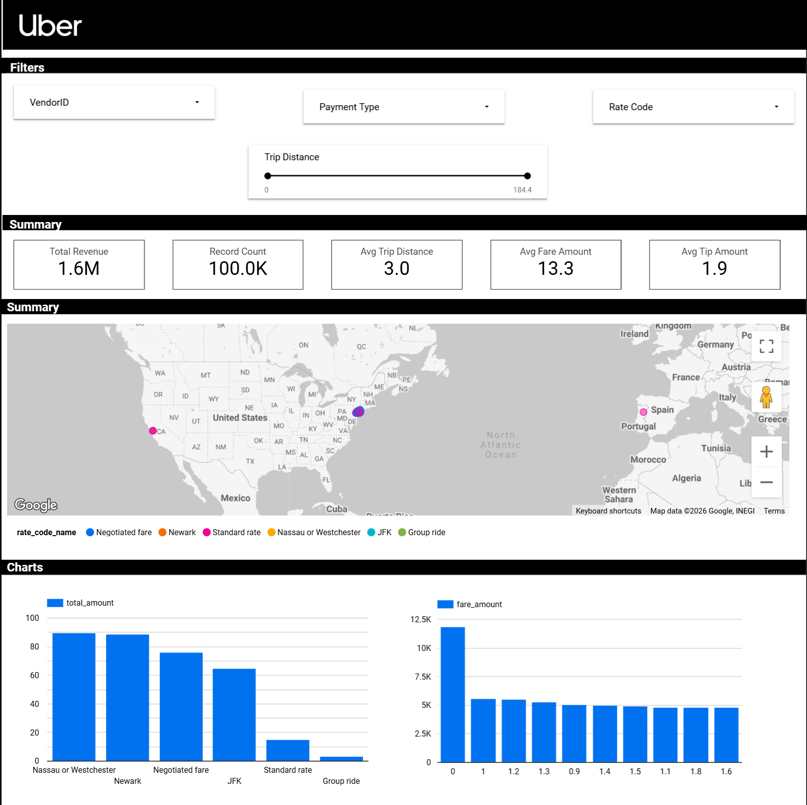

# 🚖 Uber Data Analytics | End-to-End Data Engineering Project

## 📌 Overview
Built a complete end-to-end data engineering pipeline to analyze 100,000+ Uber 
trip records, uncovering insights on revenue, trip patterns, and passenger behavior.

## 🏗️ Architecture

## 💻 Tech Stack
- **Cloud Platform:** Google Cloud Platform (GCP)
- **Storage:** GCP Cloud Storage
- **ETL Pipeline:** Mage
- **Data Warehouse:** BigQuery
- **Dashboard:** Looker Studio
- **Language:** Python

## 📊 Dashboard

## 📈 Key Insights
- 📦 **100,000** trip records processed
- 💰 **$1.6M** total revenue analyzed
- 🚗 **3.0 miles** average trip distance
- 💵 **$13.3** average fare amount
- 💡 Nassau/Westchester and Newark generate the highest revenue by rate code

## 🔧 Project Steps
1. Designed star schema data model (fact + dimension tables)
2. Wrote data transformation code in Python
3. Loaded raw data to GCP Cloud Storage
4. Built and orchestrated ETL pipeline using Mage
5. Loaded transformed data into BigQuery
6. Analyzed data using SQL in BigQuery
7. Built interactive dashboard in Looker Studio

## 📂 Dataset
- Source: TLC Trip Record Data (NYC Yellow Taxi)
- Records: 100,000+ trips

## 🔗 Links
- 📊 [Live Dashboard](https://datastudio.google.com/reporting/30a5c089-1fe0-42cb-8015-ef36967a1086)
- 📹 [Project Tutorial](https://www.youtube.com/watch?v=WpQECq5Hx9g)
